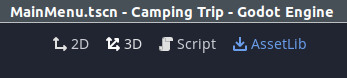
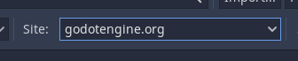
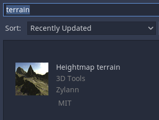
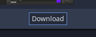
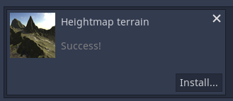
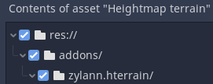
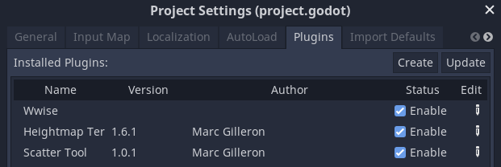
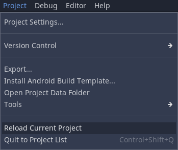

# Moon Run
A Godot Wild Jam #48 gamejam game. Theme was "Moon".

Made in Godot 3.5.0

## Installation
### Addons
* Heightmap terrain - Zylann

#### Instructions
1. Open the Asset Lib window in Godot.
   * 
2. Make sure you are searching `godotengine.org`.
   * 
3. Search for "terrain" and select `Heightmap terrain`.
   * 
4. In the details window for the plugin, select download.
   * 
5. Let the plugin download and then start the install...
   * 
6. Let the plugin install in `/addons/zylann.hterrain/`.
   * 
11. Open the Project Settings window and select the Plugins tab.
12. Under the column "Status", check the boxes to Enable the plugins.
    * 
13. Reload the project.
    * 
